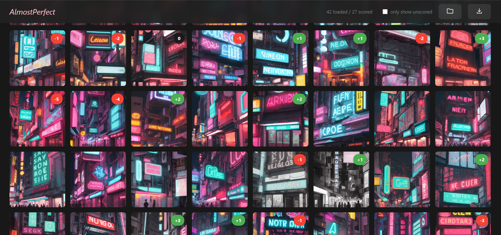
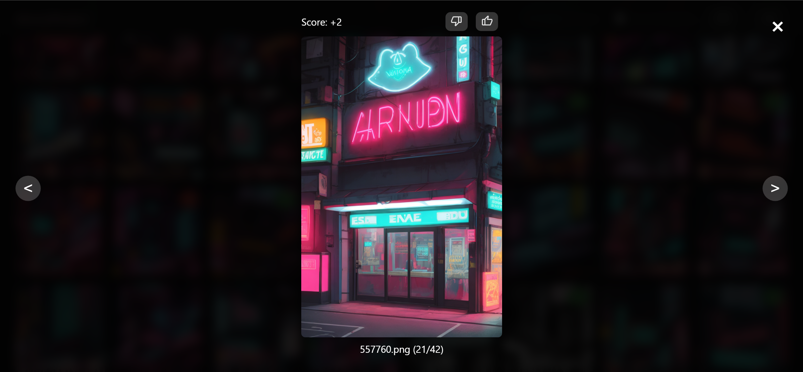

# AlmostPerfect

Simple end-to-end RLHF (Reinforcement Learning from Human Feedbacks) for diffusion models (DDPO) on personal hardware.

在个人硬件上对扩散模型进行端到端RLHF（基于人类反馈的强化学习）训练（DDPO）。

## How To Use / 如何使用

### 0. Prepare / 准备工作

- Download this repo.
  
  下载本仓库
- Download a diffusers-format checkpoint from Hugging Face. Or convert a single-file-format checkpoint to diffusers-format. Put the model under `/models/checkpoint` (default). Currently only SD1.5 models are tested. Also be sure to use the DDIM scheduler as it's supported by DDPO.

  从Hugging Face下载diffusers格式的模型检查点，或将单文件格式检查点转换为diffusers格式。将模型放置在`/models/checkpoint`目录（默认路径）。目前仅测试过SD1.5系列模型，请确保使用DDIM调度器（DDPO支持该调度器）。
- Set your parameters in `config.py`. The default parameters are tested on a 16GB GPU, but you should tweak them to fit your needs.

  在`config.py`中设置参数。默认参数在16GB显存的GPU上测试通过，请根据硬件配置调整参数。

### 1. Generate / 生成样本

- `python generate.py` This will generate sample images under `/samples`.

  该命令会在`/samples`目录下生成样本图片。

### 2. Human Feedback / 人类反馈

- You can use the provided [WebApp](https://arthur-x.github.io/AlmostPerfect) to score generated images. A detailed use guide can be found in this repo: [AlmostPerfect_frontend](https://github.com/arthur-x/AlmostPerfect_frontend). Once finished, you should get a `scores.json` file in your `/samples` directory.

  使用配套 [WebApp](https://arthur-x.github.io/AlmostPerfect) 对生成图片进行评分。详细使用指南请参考前端仓库：[AlmostPerfect_frontend](https://github.com/arthur-x/AlmostPerfect_frontend)。完成评分后，`/samples`目录下应该有`scores.json`文件。

### 3. Train Reward / 训练奖励模型

- `python train_reward.py` This trains a simple latent CNN model and saves it under `/models`. Pay special attention to not overfit the reward model. You are free to try more complex reward models, which may require modifications to this process.

  该命令将训练一个简单的潜空间CNN模型并保存在`/models`目录。特别注意避免奖励模型过拟合，可尝试更复杂的奖励模型架构（需要自行修改代码）。

### 4. Train Policy / 训练策略模型

- `python train_policy.py` This will periodically save trained LoRAs under `/outputs`, you can then use `ui_lora_epoch_xxx.safetensors` in WebUI or ComfyUI for inference. 

  该命令会定期保存训练好的LoRA权重到`/outputs`目录，生成的`ui_lora_epoch_xxx.safetensors`文件可在WebUI或ComfyUI中加载使用。

### 5. Repeat (Optional) / 循环迭代（可选）

- Go back to Step 1 with LoRA loaded if you want to continue.

  加载训练好的LoRA后，可返回第1步继续迭代优化。

## Credit / 致谢

The scripts in `utils` are adopted from the original [ddpo-pytorch](https://github.com/kvablack/ddpo-pytorch) repo. The `train_policy.py` script is also based on this repo, with lots of simplifications, optimizations and compatibility fixes for the latest libraries.

`utils` 中的脚本采用自 [ddpo-pytorch](https://github.com/kvablack/ddpo-pytorch) 原始仓库。`train_policy.py` 脚本同样基于该仓库，但进行了大量简化、优化，并针对最新的库进行了兼容性修复。
